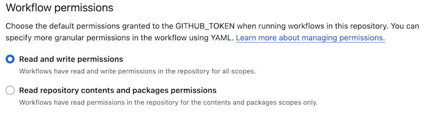
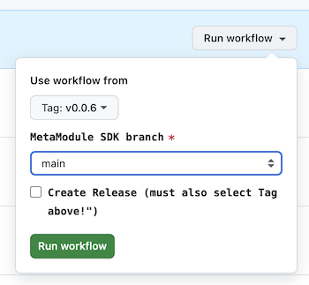

# Releasing a MetaModule Plugin

Now that you have a working plugin, it's time to share it with the world!

## Licensing and Permissions

Before you consider releasing your plugin, make sure you are 100% in
compliance will all licensing requirements and have obtained permission
from any original author(s) of the code (e.g. if you are porting a plugin
that you did not originally create).

You must read and follow all guidance here: [Licensing and Permissions](licensing_and_permissions.md).


## Listing on the official MetaModule plugins page

The official MetaModule plugin page is at [https://metamodule.info/plugins](https://metamodule.info/plugins)

We want this page to list all plugins that are available for the MetaModule
platform, so we encourage you to list your plugin here if you want others to
use it.

### Requirements

All plugins listed on our site must meet these requirements:

- The .mmplugin file name is properly written (see below)

- The plugin-mm.json file is properly populated with the maintainer's name and
  the names of the modules included (see below)

- For ports from VCV Rack or other platforms: You are the original author of
  the code, or the original author of the work has given you permission to port
  their work to the MetaModule.

Whether your code is open source or closed source does not effect how the
plugin is listed on the MetaModule plugin page. But it does matter whether the
plugin is free to download, or if you require payment.

### Free-to-download plugins:

Plugins that can be freely downloaded must meet these requirements:

- The .mmplugin file is hosted on a GitHub repo Releases page (we use this to
  scan for updates and manage versions)

- The GitHub release is NOT marked as "pre-release" (that is, we will ignore
  pre-releases)

If you do not wish to host on GitHub, email us and we can discuss alternatives
such as GitLab, hosting on our site, or static hosting.

Maintainers of free-to-download plugins just need to send us the URL to their
GitHub repo that contains the releases. Email us at 4ms@4mscompany.com or send
a message on the MetaModule forum.

### Pay-to-download plugins

Plugins that are pay-to-download need to host their own downloads (or have them 
on a third-party site) and manage payment and downloads. In this case, the
maintainers must send us at least the following:

- A link to the plugin product info or checkout page

- The compiled .mmplugin file (or at least the plugin-mm.json and SDK version)


## .mmplugin file name

The .mmplugin file name is important! It's used in three place:
- The script that scans releases for putting them on the plugin page on our website
- The MetaModule firmware plugin loader (Settings > Plugin tab, and the preloader)
- Users who want to keep all their plugins organized

The file name must be in this format:

```
[BrandSlug]-v[plugin-version]-[sdk-version].mmplugin
```

- `BrandSlug`: the file must start with the brand slug. This is the unique
  identifier for your plugin brand. For VCV-ported plugins, this is the `slug:`
  field in the `plugin.json` file.

- `plugin-version`. This is the version and revision of your plugin code. It
  must be in the form `X.Y` or `X.Y.Z` where X, Y and Z are integers. You also
  can have suffixes separated by dashes like `X.Y.Z-beta-2.1`. Just don't use 
  the reserved words `-fw` or `-dev` (see next item). For legacy reasons, this
  field is technically optional but we will ask you to add it if missing.
  Notice that there is a `v` before the first number.

- `sdk-version`. This is the SDK version used to build your plugin, which also
  tells users about the firmware version needed to load the plugin.
    - This field is mandatory if the plugin only runs on development firmware.
      In this case the field must be in the form `dev-Z`, where `Z` is the
      minimum development firmware version required.
    - This field is optional if the plugin runs on the currently 
      released firmware. If it's omitted then the website and the MM firmware
      will scan the contents to determine if it's compatible with the current
      firmware. If this field is present then it must be in the form `fw-X.Y`,
      e.g. `fw-2.0` indicates it requries firmware v2.0 or later.
        - Note: if you omit using this field in your plugin name, then it's a good
          idea to bump up the plugin version whenever you recompile with a new SDK.
          This will make it clear to users which one to use. For example if you
          originally released `Myplugin-v1.0-dev-13.mmplugin`, and then when a new
          SDK was released you recompiled it, you should *NOT* call the new release
          `Myplugin-v1.0.mmplugin`, since that would be unclear to users which one
          is more recent. Instead call it `Myplugin-v1.0.1.mmplugin` (or any
          version > 1.0) or use the -fw tag like `Myplugin-v1.0-fw-2.0.mmplugin`.

- optional text after the `sdk-version`, but before the `.mmplugin` is OK.

Example: If it's compiled with SDK v1.6, then these are all OK:
  - `Myplugin-v0.9.mmplugin` 
  - `Myplugin-v0.9-fw-1.6.mmplugin` 
  - `Myplugin-v1.2.3-fw-1.6.9.mmplugin`
  - `Myplugin-v1.2.3-fw-1.6-hotfix.mmplugin`

Example: If it's compiled with SDK v2.0, then these are all OK:
  - `Myplugin-v0.9.mmplugin` 
  - `Myplugin-v0.9-fw-2.0.mmplugin` 
  - `Myplugin-v1.2.3-fw-2.0.1.mmplugin`
  - `Myplugin-v1.2.3-fw-2.0-test.mmplugin`

Example: If it's compiled with SDK v2.0-dev-13, then these are all OK:
  - `Myplugin-v0.9.mmplugin` 
  - `Myplugin-v0.9-dev-13.mmplugin` 
  - `Myplugin-v14.2-dev-13.1.mmplugin`
  - `Myplugin-v1.2.3-dev-13.6.mmplugin`

Notice `Myplugin-v0.9.mmplugin` could be valid for v1.6 or v2.0 firmware.
This ambiguity will not happen in actual circumstance because when re-compiling
with a newer SDK you should bump up the plugin version (or use the -fw-X.Y tag).
The website and MM firmware will scan the contents of the plugin file
to determine the SDK version, so no special considerations need to be made with
regards to those.


## Plugin-mm.json file

This json file will get packaged into the plugin by the SDK cmake script. 
At minimum, to be listed on the website, it must contain these fields:

```json
{
	"MetaModuleBrandName": "Display Name for Plugin",
	"MetaModulePluginMaintainer": "My Name",
	"MetaModulePluginMaintainerEmail": "myname@example.com",
	"MetaModuleDescription": "A brief note describing the plugin (if it's a port of another work, mention that here)",
	"MetaModuleIncludedModules": [
        {
            "slug": "Module1",
            "name": "Module Number One"
        },
        {
            "slug": "Module2",
            "name": "Module Number Two"
        }
    ]
}
```

See the [plugin-mm.json](plugin-mm.json) docs for descriptions of the fields, and more fields you can add.

The file must be valid json and not contain syntax errors (json is very picky).
Consider running it in an online json checker to verify it.


## Publishing by manually creating Github releases

This is a simple way to publish a release, but it takes some steps to do each time
you make a release. See the next section if you want to set up an automatic release system.

In a Github repo, go to the Releases tab and click the button to draft a new release.

You need to create a new tag: click Choose a tag and then type a tag name in the box. Click "Create new tag (..your tag..) on publish"
Any tag would work, but a good practice is to use the version for your tag. For instance, "v0.8" if your plugin is currently v0.8.
You also can put the sdk version in the tag if you intend to make a separate tag for each SDK version (e.g. "v0.8-fw-1.6" and "v0.8-dev-12.2")

Next, type in a title and description for your release.

Then, upload your .mmplugin file(s) to the release with the "Attach binaries here" box.

The .mmplugin files must be named properly, see the section above.

Make sure "Set this as pre-release" is not checked, or else we won't be able to add it to our site.
If for some reason you want to hide a release from our website, checking this box will do that.

Click "Publish Release" and send us a message to scan for your new release!


## Publishing with a Github Workflow

This is optional, and takes some time to set up, but it pays off by making 
it easy to generate releases.

Use this file as a template and save it as a .yml file in your
.github/workflows/ dir (create that dir if it doesn't exist), for example
`.github/workflows/build-metamodule-plugin.yml`. Then commit and push this file
to github. 


```yml
name: Build and release MetaModule plugin

on:
  workflow_dispatch:
    inputs:
      SDK_branch:
        description: 'MetaModule SDK branch'
        required: true
        type: choice
        options:
          - main
          - v2.0-dev
      do_release:
        description: 'Create Release (must also select Tag above!")'
        required: true
        default: false
        type: boolean

jobs:
  build-lin:
    strategy:
        matrix:
          gcc: ['12.3.Rel1']
    name: "Build firmware on linux"
    runs-on: ubuntu-24.04
    steps:
      - name: Install Arm GNU Toolchain (arm-none-eabi-gcc)
        uses: carlosperate/arm-none-eabi-gcc-action@v1
        with:
          release: ${{ matrix.gcc }}

      - name: Install cmake
        uses: jwlawson/actions-setup-cmake@v1.13
        with:
          cmake-version: '3.26.x'

      - name: Git setup
        run: git config --global --add safe.directory '*'

      - name: Checkout
        uses: actions/checkout@v4
        with:
          submodules: 'recursive'

      - name: Install linux dependencies
        run: |
          sudo apt-get update
          sudo apt-get install ninja-build

      - name: Set Release Version
        if: startsWith(github.ref, 'refs/tags/')
        uses: FranzDiebold/github-env-vars-action@v2

      - name: Build
        run: |
          mkdir -p metamodule-plugins
          # Get the SDK
          git clone -b ${{ inputs.SDK_branch }} https://github.com/4ms/metamodule-plugin-sdk --recursive 
          # Validate plugin-mm.json syntax
          jq -e . plugin-mm.json >/dev/null || exit 1
          # Build the plugin
          cmake -B build -G Ninja -DMETAMODULE_SDK_DIR=metamodule-plugin-sdk
          cmake --build build
          # Add version tag and required firmware version to the plugin file name:
          cd metamodule-plugins && for f in *.mmplugin; do mv $f ${f%.mmplugin}-${{ env.CI_REF_NAME }}.mmplugin; done;

      - name: Release
        if: startsWith(github.ref, 'refs/tags/') && ${{ inputs.do_release }}
        uses: softprops/action-gh-release@v2
        with:
          name: "Release: ${{ env.CI_REF_NAME }}"
          files: |
            metamodule-plugins/*.mmplugin
```

Go to your repo's GitHub page and make sure you see the "Build and release
MetaModule plugin" action in the Actions tab. If not, check your settings to
see if Actions or workflows is enabled.

In your repo Settings, click Actions > General in the left side bar. Then scroll
down to "Workflow permissions" and enable "Read and write permissions"




To make a release, you need to push a version tag the above sections. For example:

```
git tag -a v1.0 -m "First release, yay!"
git push origin v1.0
```

The version in the tag you create will get appended to the name of the plugin file.
In the above, the plugin will be named `Plugin-v1.0.mmplugin`. So make sure your tag
follows the rules for naming plugins.

If you want release for the firmware dev-13, for example, then do this:

```
git tag -a v1.0-dev-13 -m "First release for firmware dev-13, yay!"
git push origin v1.0-dev-13
```

This will make a plugin file named `Plugin-v1.0-dev-13.mmplugin`

Then you can go to the Actions tab on the github site for your repo and click
on the "Build and release plugin" action. On the right, you can then select
"Run workflow":



From this menu, you will need to pick the tag you just pushed. This is important:
you cannot pick a branch, you have to pick a tag. Github does not allow releases
from branches, only from tags. If you don't see the tag you just pushed, make
sure you really pushed it and refresh your browser. You can go ahead and run
the workflow without a tag, but you cannot generate a release without a tag.

Then pick the SDK version you want to build with (main or v2.0-dev). Check the
"Create release" checkbox (unless you just want to test building).

After it's done building, you will see the release on the Releases tab (assuming 
you chose a tag -- not a branch -- and you clicked "Create Release").

Now, send us a message to add your release.

If you need different options for the SDK version, you can modify this script
to pick a different branch or tag. Or, a more flexible approach is to include
the SDK as a submodule (maybe your repo already does this?), in which case
there's no need for the SDK branch selection, so you'll want to remove that
from the workflow script.

Another improvement is to have the workflow automatically run when you push a
tag. You can also can run the workflow from the command line using the `gh`
program (that's [how we build our
releases](https://github.com/4ms/metamodule-plugin-examples/blob/main/release.sh)).

Github has extensive docs on workflows, and there are tons of examples
online.

